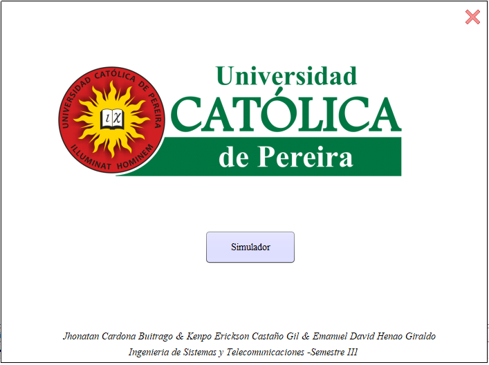
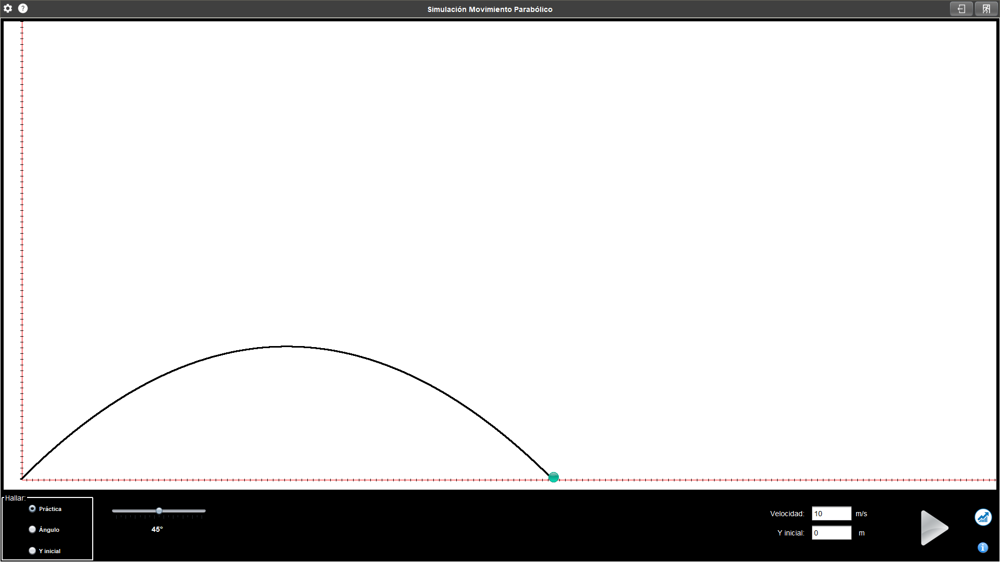
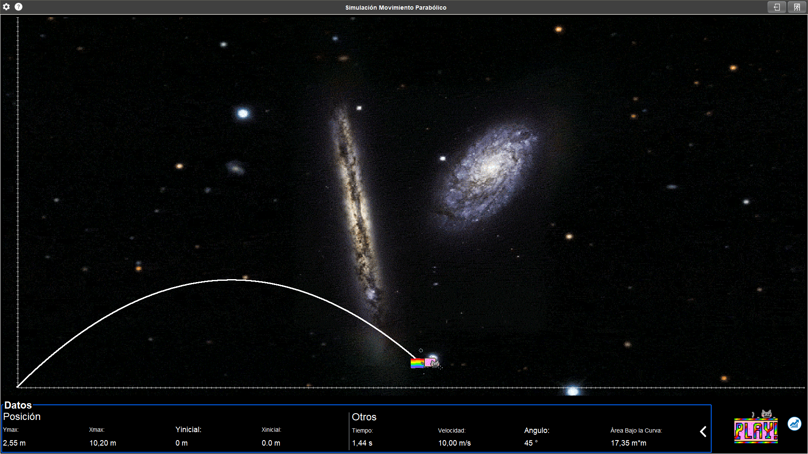

# SimuladorParabolico
Proyecto realizado para el colectivo, en el cual se simula el movimiento parabólico de un proyectil, ademas de ofrecer datos de interés sobre el movimiento

## Vistas

### Reconocimiento a mis **estimados** compañeros que permitieron que fuera posible:

### Vista Principal del Simulador

